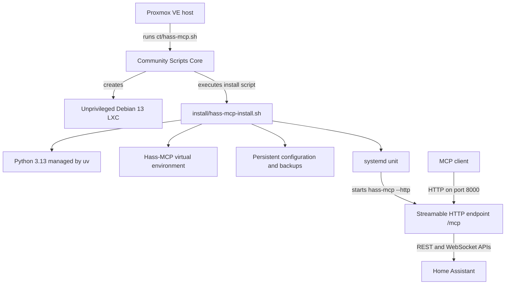
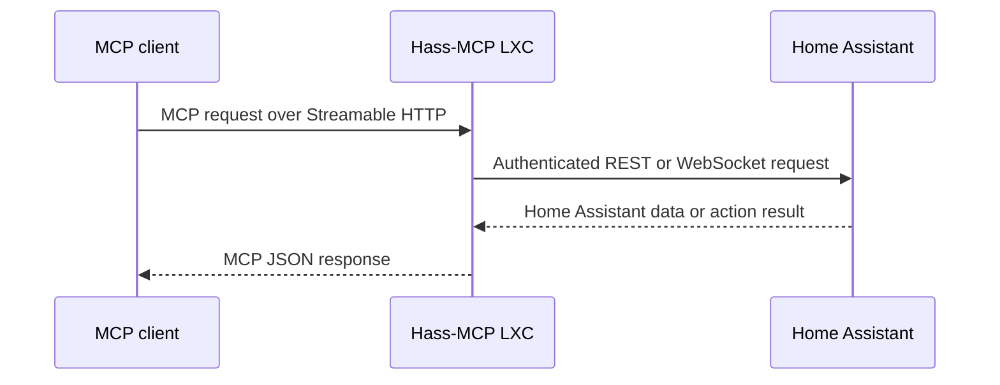

# Proxmox Hass-MCP architecture and implementation

## Scope

This project creates and maintains a single-purpose Debian 13 LXC that runs Hass-MCP using MCP Streamable HTTP transport. It uses the Community Scripts Core engine for LXC lifecycle management while keeping application installation logic in this repository.

The implementation deliberately excludes Docker, Home Assistant installation, public ingress, TLS termination, and MCP client authentication.

## Repository layout

| Path | Responsibility |
| --- | --- |
| `ct/hass-mcp.sh` | Defines LXC defaults, collects application settings, invokes Community Scripts Core, and implements updates. |
| `install/hass-mcp-install.sh` | Runs inside the new LXC, installs Python and Hass-MCP, writes configuration, and creates the systemd unit. |
| `json/hass-mcp.json` | Describes the application, defaults, input variables, and warnings in Community Scripts catalog format. |
| `README.md` | Provides installation, setup, operation, and troubleshooting instructions. |
| `ARCHITECTURE.md` | Records the design, boundaries, paths, and lifecycle described here. |
| `.gitignore` | Excludes AI harnesses, assistant configuration, and local development artifacts. |
| `LICENSE` | Contains the MIT license for this project. |

## Deployment flow



The host-side script obtains the shared engine from `community-scripts/core`. For a local checkout, Core discovers the repository root containing `ct/` and `install/` and reads the installation script from disk. For a raw remote invocation, the Core runner must receive the repository's raw base URL so it can fetch both files from the same source.

## Runtime components

| Component | Implementation |
| --- | --- |
| Operating system | Debian 13 LXC |
| Isolation | Unprivileged LXC |
| Python | Python 3.13 installed through Community Scripts `setup_uv` |
| Package installation | `uv pip install` from PyPI |
| Application environment | `/opt/hass-mcp` |
| Persistent state | `/opt/hass-mcp_data` |
| Process manager | systemd |
| Service unit | `/etc/systemd/system/hass-mcp.service` |
| Transport | Stateless MCP Streamable HTTP |
| Bind address | `0.0.0.0` |
| Default port | `8000` |
| Endpoint | `/mcp` |

## Installation model

The installation script performs these operations in order:

1. Initializes Community Scripts installation helpers and updates Debian packages.
2. Validates that a Home Assistant token is present and that the MCP port is valid.
3. Installs `uv` and Python 3.13 through `setup_uv`.
4. Reads the latest stable Hass-MCP version from the upstream GitHub release API.
5. Creates a Python environment at `/opt/hass-mcp`.
6. Installs the corresponding `hass-mcp` package version from PyPI.
7. Records the installed version in `/root/.hass-mcp` for Community Scripts update checks.
8. Creates persistent configuration and backup directories under `/opt/hass-mcp_data`.
9. Writes the protected environment file.
10. Creates, enables, and starts the systemd service.
11. Applies standard Community Scripts LXC customization and cleanup.

The GitHub release and PyPI package versions are expected to correspond. This follows the upstream release model while avoiding a source build that would require Git metadata for `hatch-vcs` version resolution.

## Configuration model

The installation accepts three application variables:

| Variable | Required | Default | Destination |
| --- | --- | --- | --- |
| `var_ha_url` | Yes | `http://homeassistant.local:8123` | `HA_URL` |
| `var_ha_token` | Yes | None | `HA_TOKEN` |
| `var_mcp_port` | Yes | `8000` | `MCP_PORT` |

The generated `/opt/hass-mcp_data/hass-mcp.env` also defines:

```text
HASS_MCP_BACKUP_DIR=/opt/hass-mcp_data/dashboard-backups
MCP_TRANSPORT=streamable-http
MCP_HOST=0.0.0.0
PYTHONUNBUFFERED=1
```

The systemd unit loads this file with `EnvironmentFile=` and launches:

```text
/opt/hass-mcp/bin/hass-mcp --http
```

Hass-MCP reads the bind address and port from the environment. The `--http` argument selects Streamable HTTP mode and configures the upstream server for stateless JSON responses.

## Filesystem and persistence

```text
/opt/hass-mcp/
  bin/hass-mcp                 Python entrypoint
  bin/python                   Managed Python interpreter
  lib/                         Installed Python packages

/opt/hass-mcp_data/
  hass-mcp.env                 Runtime configuration and Home Assistant token
  dashboard-backups/           Backups made before dashboard modifications

/etc/systemd/system/
  hass-mcp.service             Service definition

/root/
  .hass-mcp                    Installed-version marker
```

The Python environment and persistent data are separated intentionally. Package updates modify `/opt/hass-mcp`; they do not replace `/opt/hass-mcp_data`.

The environment file is mode `600`. The token remains available to the root-owned Hass-MCP process and to administrators with root access inside the LXC.

## Request path



Hass-MCP sends the configured Home Assistant token as a bearer credential when calling Home Assistant. The MCP client does not receive that token.

## Update lifecycle

The `customize` helper creates `/usr/bin/update` inside the LXC. Running `update` executes the update function in `ct/hass-mcp.sh`:

1. Confirm that `/opt/hass-mcp/bin/hass-mcp` exists.
2. Compare `/root/.hass-mcp` with the latest stable upstream GitHub release.
3. Stop `hass-mcp.service` when an update is available.
4. Upgrade the Python package to the exact corresponding PyPI version.
5. Replace the version marker.
6. Start the service.

Configuration and dashboard backups are not copied during updates because they are already stored outside the application environment.

## Security boundaries

### Proxmox and LXC boundary

The application runs in an unprivileged, single-purpose LXC. It does not require Docker, privileged mode, device passthrough, or access to the Proxmox host filesystem.

### Home Assistant boundary

The Home Assistant token defines the actions available to Hass-MCP. The token inherits the permissions of its Home Assistant user. Revoking the token or disabling that user removes Hass-MCP's Home Assistant access.

### MCP network boundary

The service listens on every LXC interface to support network MCP clients. Hass-MCP does not authenticate those clients. Network reachability is therefore the effective authorization boundary for the MCP endpoint.

A production deployment must restrict access using firewall rules, a trusted network, a VPN, a zero-trust access system, or an authenticated reverse proxy. Direct public exposure is outside this architecture.

### Secrets boundary

The token is collected through hidden terminal input during an interactive installation. It is written only to the protected environment file. The scripts do not print the token in completion output or service logs.

## Resource model

The default allocation is one CPU core, 512 MiB of memory, and 4 GiB of disk. Hass-MCP is an asynchronous Python service without a local database, message broker, or application build pipeline. Persistent storage growth is primarily driven by dashboard backup retention and normal operating-system logs.

## Architecture decisions

### Bare-metal installation

Community Scripts application containers install software directly rather than nesting Docker. A Python environment provides application dependency isolation while the LXC remains the operating-system isolation boundary.

### PyPI package deployment

The upstream package is installed from PyPI because it provides the supported `hass-mcp` entrypoint and avoids rebuilding the application from a GitHub source archive. Upstream source builds use dynamic versioning through `hatch-vcs` and require Git metadata.

### External persistent directory

Configuration and dashboard backups live in `/opt/hass-mcp_data`, separate from `/opt/hass-mcp`. This allows the Python environment to be upgraded or reconstructed without moving secrets or persistent backups.

### Direct Streamable HTTP exposure

The service binds directly to the LXC network rather than installing a reverse proxy. This keeps the helper focused and permits operators to choose their own firewall, VPN, proxy, certificate, and authentication design. The tradeoff is that the default endpoint must remain within a trusted network.

## Verification and future work

Current implementation validation covers Bash parsing, JSON parsing, Python 3.13 package installation, MCP Streamable HTTP initialization, and tool discovery.

Before broader distribution:

1. Complete an installation and update cycle on a Proxmox VE host using Debian 13.
2. Verify restoration through the normal Proxmox backup process.
3. Test ARM64 on actual hardware before setting `var_arm64=yes` and advertising ARM64 metadata.
4. Exercise Home Assistant entity reads, service calls, WebSocket operations, and dashboard backup restoration with a non-production Home Assistant instance.
5. Review Community Scripts contribution rules again before proposing inclusion in ProxmoxVED.
